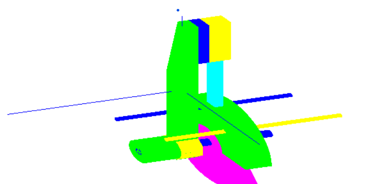

# 🪚 Chainsaw — Computer Graphics Lab Project

This project is a **3D Chainsaw Simulation** built using **OpenGL (GLUT)**.  
It demonstrates hierarchical modeling, transformations, and basic animation control using keyboard inputs.

---

## 🖼️ Preview




## 🧩 Features

- 3D **Chainsaw model** composed of multiple meshes:
  - Holder  
  - Slider  
  - Wheel  
  - Cylinder and connector components
- Demonstrates **hierarchical transformations** using `glPushMatrix()` and `glPopMatrix()`
- Uses **GLUT** for window management and keyboard input
- Supports **colorful mesh rendering**
- Real-time **interactive control**

---

## 🎮 Controls

| Key | Action |
|-----|---------|
| **1** | Rotate the wheel clockwise (start the chainsaw motion) |
| **2** | Rotate the wheel counterclockwise (reverse motion) |
| **ESC** | Exit the program |

---

## 🖥️ Requirements

- C++ compiler (e.g., Visual Studio, MinGW, or g++)
- OpenGL and GLUT libraries installed

---

## 🧠 Concepts Demonstrated

- **3D transformations:** translation, rotation, scaling  
- **Hierarchical modeling:** parent–child relationships between parts  
- **Matrix stack usage:** local vs global coordinate systems  
- **Keyboard input handling:** using `glutKeyboardFunc()`  
- **Double buffering** and **depth testing**

---

## 🚀 How to Run

1. Clone or copy the source files into your local project.
2. Build the project using your C++ IDE or compiler:
   ```bash
   g++ Bai3.cpp Mesh.cpp -lglut -lGLU -lGL -o chainsaw
